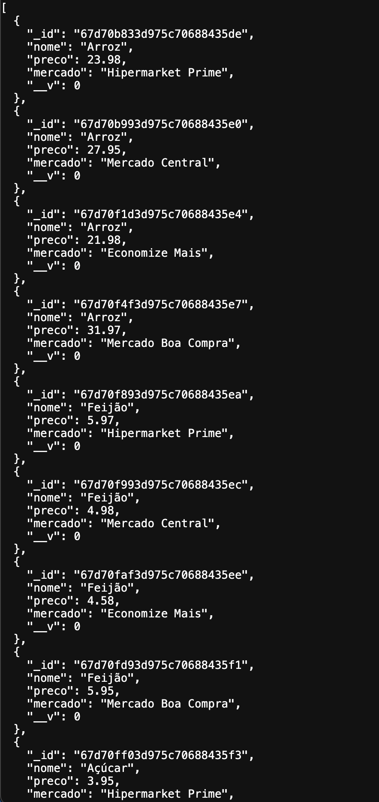

# 🛒 Price Comparator

Uma aplicação web para facilitar a comparação de preços de produtos em mercados fictícios, com foco em ajudar pessoas de baixa renda a economizar.
A plataforma simula uma rede fictícia de mercados, permitindo que o usuário compare os preços de forma prática e rápida, como se estivesse pesquisando em mercados reais próximos.

### Imagem do Projeto 👇


## Índice

- <a href="#objetivo">Objetivo</a>
- <a href="#funcionalidades">Funcionalidades</a>
- <a href="#tecnologias-utilizadas">Tecnologias utilizadas</a>
- <a href="#como-rodar-o-projeto-localmente">Como rodar o projeto localmente</a>
- <a href="#deploy"> Deploy</a>
- <a href="#desenvolvido-por"> Desenvolvido por</a>

## 🎯Objetivo
O Price Comparator tem como principal missão promover o consumo consciente e facilitar o acesso a informações de preços, ajudando pessoas de baixa renda a economizar no dia a dia.
A plataforma simula uma rede de mercados fictícios, cadastrados via API, juntamente com seus produtos, permitindo que os usuários realizem buscas e comparações rápidas e eficientes de preços.

## 🚀Funcionalidades
- 🔎 Buscar produtos pelo nome.
- 📊 Comparar preços entre mercados fictícios.
- 🏆 Destaque automático para o menor preço.
- 🔄 Feedback visual de carregamento.
- ⚠️ Exibição de mensagens de erro caso a API esteja indisponível.

## 🖥️Tecnologias utilizadas
- Frontend: Next.js, React, Tailwind CSS
- Backend: Node.js, Express.js
- Banco de Dados: MongoDB Atlas
- Hospedagem: Vercel (frontend), Render (backend)
- Testes: Postman

## ⚙️Como rodar o projeto localmente

1. Clone o repositório:
```bash
git clone https://github.com/seu-usuario/price-comparator.git
cd price-comparator
```

2. Instale as dependências:
```bash
npm install
```
## ou
```bash
yarn install
```

3. Configure as variáveis de ambiente:

Crie um arquivo **.env** na raiz do projeto:
```bash
NEXT_PUBLIC_API_URL=http://localhost:5000
```
Ajuste conforme o ambiente desejado.

4. Execute o servidor de desenvolvimento
```bash
npm run dev
```
Acesse: http://localhost:3000

## 📊 Exemplo de Dados da API
Abaixo está um exemplo de resposta da API ao solicitar informações dos produtos cadastrados.


Cada produto possui:

- nome: o nome do produto.
- preco: valor do produto.
- mercado: nome do mercado onde o produto foi cadastrado.
- _id: gerado automaticamente pelo banco de dados.
- __v: versão do documento, gerenciada automaticamente pelo Mongoose.

## 📦Deploy
- **Frontend:** Aplicação web - [https://price-comparator-nine.vercel.app](https://price-comparator-nine.vercel.app)
- **Backend (API):** Endpoints REST — [https://price-comparator-2hvq.onrender.com/produtos](https://price-comparator-2hvq.onrender.com/produtos)

## 👩🏽‍💻Desenvolvido por
### Amanda Hellen

## 📄 Licença
Este projeto está licenciado sob a [MIT License](./LICENSE.md).
